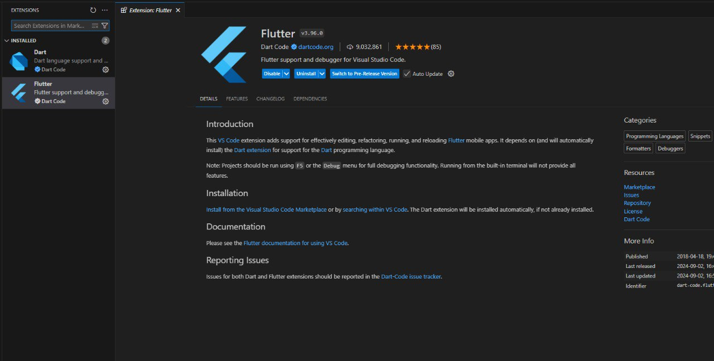

# Отчет по практике №1
## Дисциплина: Программирование корпоративных систем
### Студент: Шуленина АС
### Группа: ЭФБО-07-22
### Шифр: 
### Преподаватель: Адышкин Сергей Сергеевич
### Семестр - 5 семестр, 2024-2025 гг.
_____

# Первое приложение Flutter
## Этапы создания приложения 
### 1. Загрузка программы для написание кода VSCode и необходимые компоненты для разработки. 
1. __Загрузить расширение в VSCode Flutter__
   

____
### 2. Установить [Flutter](https://docs.flutter.dev/get-started/install/windows/mobile) на официальном сайте 

___
